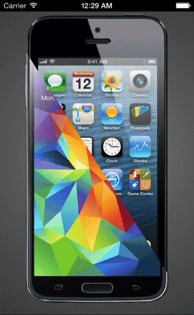

## DiagonalSelection

[VICE VERSA]: https://www.behance.net/gallery/VICE-VERSA-diagonal-UI-optimized-for-single-hand-IX/12419409
DiagonalSelection is inspired on the amazing [VICE VERSA] concept by Michel Oh.




## Usage

To use it, add DFDiagonalSelection.h and DFDiagonalSelection.m files to your project.

Initializing and adding the DiagonalSelection to the screen

```objective-c
DFDiagonalSelection *diagonalSelection = [[DFDiagonalSelection alloc] initWithFrame:frame LeftImage:leftImage RightImage:rightImage];
[self.view addSubview:diagonalSelection];
```

When the user manipulates the switch control ("flips" it) a `UIControlEventValueChanged` event is generated.

```objective-c
[mySwitch addTarget:self action:@selector(switchChanged:) forControlEvents:UIControlEventValueChanged];
```

You can set images for the left and right sides of the selector.
Keep in mind that, to get the expected effect, it's best to have two full images that can be equally sliced in half.

```objective-c
diagonalSelection.leftImage = [UIImage imageNamed:@"iphone"];
diagonalSelection.rightImage = [UIImage imageNamed:@"galaxy"];
```

## Requirements

* iOS 6.0
* ARC

## License

The MIT License (MIT)

Copyright (c) 2014 David Freitas

Permission is hereby granted, free of charge, to any person obtaining a copy
of this software and associated documentation files (the "Software"), to deal
in the Software without restriction, including without limitation the rights
to use, copy, modify, merge, publish, distribute, sublicense, and/or sell
copies of the Software, and to permit persons to whom the Software is
furnished to do so, subject to the following conditions:

The above copyright notice and this permission notice shall be included in
all copies or substantial portions of the Software.

THE SOFTWARE IS PROVIDED "AS IS", WITHOUT WARRANTY OF ANY KIND, EXPRESS OR
IMPLIED, INCLUDING BUT NOT LIMITED TO THE WARRANTIES OF MERCHANTABILITY,
FITNESS FOR A PARTICULAR PURPOSE AND NONINFRINGEMENT. IN NO EVENT SHALL THE
AUTHORS OR COPYRIGHT HOLDERS BE LIABLE FOR ANY CLAIM, DAMAGES OR OTHER
LIABILITY, WHETHER IN AN ACTION OF CONTRACT, TORT OR OTHERWISE, ARISING FROM,
OUT OF OR IN CONNECTION WITH THE SOFTWARE OR THE USE OR OTHER DEALINGS IN
THE SOFTWARE.